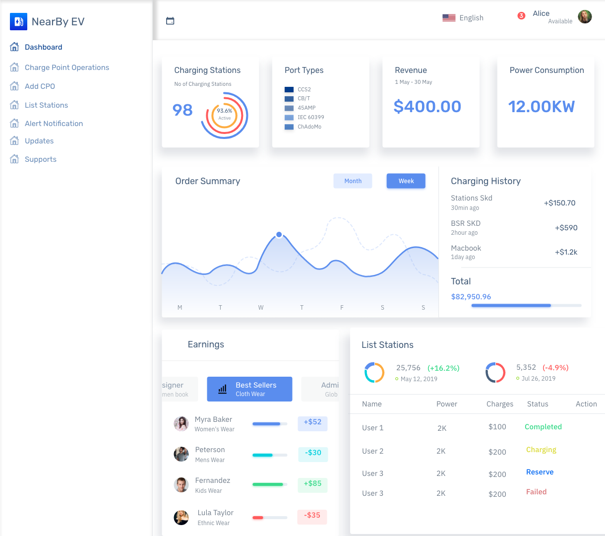

<p align="center">
  <a href="" rel="noopener">
 </a>
</p>

<h3 align="center">NearBy EV</h3>

<div align="center">

[]()
[](https://github.com/NearByEV-Charging/Console-Admin-Website/issues)
[](https://github.com/NearByEV-Charging/Console-Admin-Website/pulls)
[](/LICENSE)

</div>

---

<p align="center"> OCPP and OCP front Website tools management users, billing management, order management.
    <br> 
</p>

## 📝 Table of Contents

- [About](#about)
- [Getting Started](#getting_started)
- [Deployment](#deployment)
- [Usage](#usage)
- [Built Using](#built_using)
- [TODO](../TODO.md)
- [Contributing](../CONTRIBUTING.md)
- [Authors](#authors)
- [Acknowledgments](#acknowledgement)

## 🧐 About <a name = "about"></a>

Write about 1-2 paragraphs describing the purpose of your project.

## 🏁 Getting Started <a name = "getting_started"></a>

These instructions will get you a copy of the project up and running on your local machine for development and testing purposes. See [deployment](#deployment) for notes on how to deploy the project on a live system.

### Prerequisites

What things you need to install the software and how to install them.

```
flutter doctor -v
```

### Installing

A step by step series of examples that tell you how to get a development env running.

Say what the step will be

```
flutter run android
```


End with an example of getting some data out of the system or using it for a little demo.

## 🔧 Running the tests <a name = "tests"></a>

Explain how to run the automated tests for this system.

### Break down into end to end tests

Explain what these tests test and why

```
flutter test
```

## 🎈 Usage <a name="usage"></a>

Add notes about how to use the system.

## 🚀 Deployment <a name = "deployment"></a>

Add additional notes about how to deploy this on a live system.

## ⛏️ Built Using <a name = "built_using"></a>

- [Firebase](https://www.firebase.com/) - Firebase
- [Flutter](https://expressjs.com/) - Flutter Framework
- [Android](https://android.com/) - java/kotlin/Android Framework
- [iOS](https://apple.com/) - Swift iOS

## ✍️ Authors <a name = "authors"></a>

- [@skbhati199](https://github.com/skbhati199) - Idea & Initial work

See also the list of [contributors](https://github.com/skbhati199/The-Documentation-Compendium/contributors) who participated in this project.

## 🎉 Acknowledgements <a name = "acknowledgement"></a>

- Hat tip to anyone whose code was used
- Inspiration
- References
